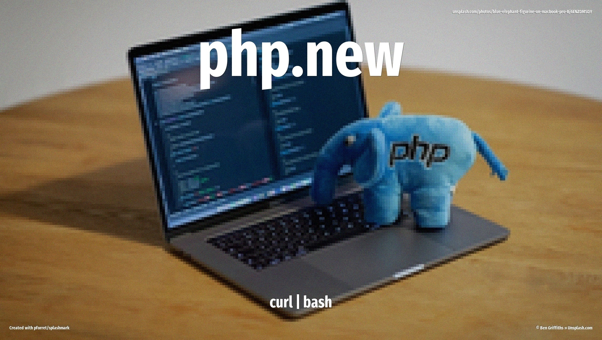

Ever wanted to go from zero to PHP in under a minute? The `php.new` installer is Laravel's gift to developers who just want to start coding without wrestling with Homebrew formulas or compilation flags. One curl command and you've got PHP 8.4, Composer, and the Laravel installer ready to roll — all tucked away in your home directory.



<!-- more -->

## Script info

| | |
|---|---|
| **URL** | `https://php.new/install/mac/8.4` |
| **Invocation** | `/bin/bash -c "$(curl -fsSL https://php.new/install/mac/8.4)"` |
| **Total lines** | 213 |
| **Comments** | 9 lines |
| **Blank** | 16 lines |
| **Boilerplate** | 48 lines (spinners, colored output, success messages) |
| **Installation** | 140 lines (actual work) |

## What does it change?

### Files and folders

The script creates a cozy little home for your PHP setup:

- **`~/.config/herd-lite/bin/`** — the main installation directory
- **`php`** — a standalone PHP 8.4 binary (ARM64 or x64 depending on your Mac)
- **`composer`** — the PHP package manager we all know and love
- **`laravel`** — the Laravel installer for spinning up new projects
- **`cacert.pem`** — SSL certificates so PHP can make secure connections
- **`php.ini`** — basic configuration pointing to those certificates
- **`uninstall_herd_lite`** — a handy cleanup script (how thoughtful!)

### Downloads

The script fetches everything from `download.herdphp.com`:

- PHP binary (architecture-specific — it checks if you're on Apple Silicon or Intel)
- Composer binary
- Laravel installer
- CA certificate bundle from `curl.se` (the official source)

### Environment changes

Here's where things get a bit more permanent. The script modifies your shell profile to add the install directory to your PATH:

- For **zsh** users: checks `~/.zshrc`, `~/.zprofile`, or `~/.profile`
- For **bash** users: checks `~/.bashrc`, `~/.bash_profile`, or `~/.profile`

It adds two lines to whichever profile file it finds first:
```bash
export PATH="$HOME/.config/herd-lite/bin:$PATH"
export PHP_INI_SCAN_DIR="$HOME/.config/herd-lite/bin:$PHP_INI_SCAN_DIR"
```

**Heads up:** If you already have PHP installed via Homebrew or another method, this will put the Herd Lite version first in your PATH. That's usually fine, but worth knowing!

### Permissions

All downloaded binaries get marked as executable. No admin permissions needed — everything lives in your home directory.

### Smart checks

The script is polite enough to ask before proceeding if it detects you already have the full Laravel Herd app installed. No accidental duplicates here!

## Changed your mind?

Good news — the script creates its own uninstall helper! Just run:

```bash
~/.config/herd-lite/bin/uninstall_herd_lite
```

This removes the entire `~/.config/herd-lite/bin/` directory. However, you'll want to manually clean up your shell profile. Open your `~/.zshrc` (or whichever profile file was modified) and remove these lines:

```bash
export PATH="$HOME/.config/herd-lite/bin:$PATH"
export PHP_INI_SCAN_DIR="$HOME/.config/herd-lite/bin:$PHP_INI_SCAN_DIR"
```

Then restart your terminal or run `source ~/.zshrc` to apply the changes. You're back to square one!

## Full source

The full script source is saved as [`scripts/php_new_install_mac_8_4.txt`](../../scripts/php_new_install_mac_8_4.txt).
