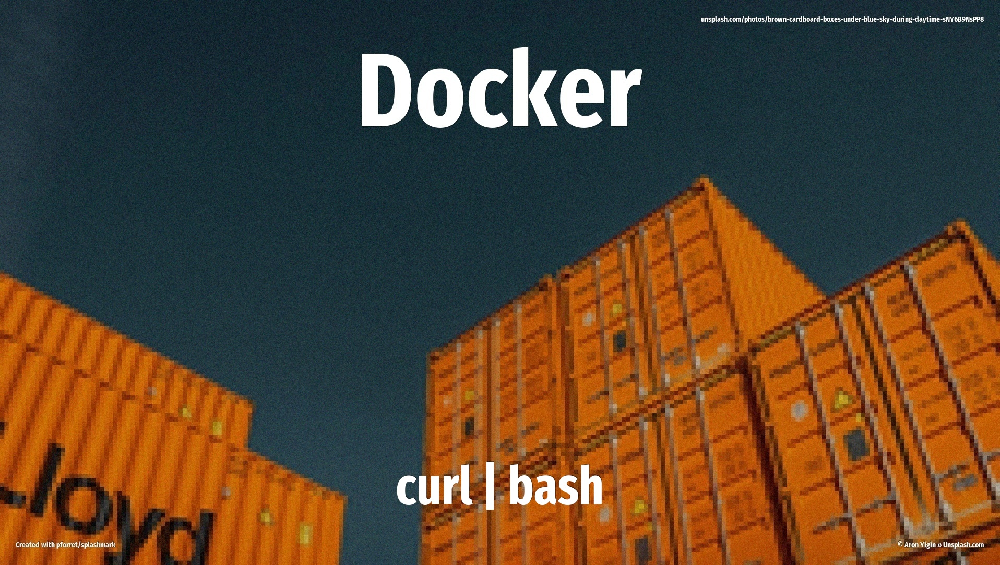

Want to containerize your life? Docker's one-liner install script is how millions of developers get their container engine up and running on Linux. Run `curl -fsSL https://get.docker.com | bash` and you'll have Docker Engine, Docker CLI, Docker Compose, Buildx, and containerd ready to spin up containers. The script auto-detects your distro, configures package repos, and installs everything with admin privileges.



<!-- more -->

## Script info

| | |
|---|---|
| **URL** | `https://get.docker.com` |
| **Invocation** | `curl -fsSL https://get.docker.com \| bash` |
| **Total lines** | 764 |
| **Comments** | 97 lines |
| **Blank** | 35 lines |
| **Boilerplate** | 95 lines (output formatting, deprecation warnings, help text) |
| **Installation** | 537 lines (actual work) |

## What does it change?

### Files and folders

The script creates and modifies several system files:

- **`/etc/apt/keyrings/docker.asc`** — Docker's GPG signing key for Debian/Ubuntu systems. The script downloads this from Docker's servers and sets it readable by all users.
- **`/etc/apt/sources.list.d/docker.list`** — A new apt repository pointing to Docker's package server, configured for your specific distro and version.
- **`/etc/yum.repos.d/docker-ce.repo`** — For RHEL/CentOS/Fedora users, this is the yum/dnf repository config file.

### Packages installed

Here's what gets added to your system — it's quite a party:

- **docker-ce** — The main Docker Engine daemon
- **docker-ce-cli** — Command-line interface for talking to Docker
- **containerd.io** — The container runtime that does the heavy lifting
- **docker-compose-plugin** — Run multi-container apps with a simple YAML file
- **docker-buildx-plugin** — Extended build capabilities with BuildKit
- **docker-ce-rootless-extras** — Tools for running Docker without root (nice for security)
- **docker-model-plugin** — Added in recent versions for AI model management

The script also installs prerequisite packages like `ca-certificates` and `curl` if they're missing.

### Downloads

The script fetches from Docker's CDN:

- Docker's GPG key from `https://download.docker.com/linux/<distro>/gpg`
- Repository configuration from `https://download.docker.com/linux/<distro>/docker-ce.repo` (for RHEL-based systems)

Mirrors are available for users in China (Aliyun and Azure China Cloud).

### Services

By default, the script enables and starts the Docker service immediately using systemd:

- **`docker.service`** — Gets enabled and started automatically so Docker's ready to go right after installation

Use `--no-autostart` if you'd rather start it manually later.

### Permissions

This script needs admin privileges to run — it'll use whatever's available between your regular user account and root access. It modifies system package repositories and installs system-wide services.

Before you yolo this into your terminal, know that:

- It runs with elevated permissions throughout
- It modifies system package manager configuration
- It installs and enables a system service
- On systems with existing Docker installs, it warns you and waits 20 seconds before proceeding

## Changed your mind?

Docker's pretty great, but if you need to roll back, here's the undo button:

**For Debian/Ubuntu:**
```bash
sudo apt-get purge docker-ce docker-ce-cli containerd.io docker-compose-plugin docker-buildx-plugin docker-ce-rootless-extras docker-model-plugin
sudo rm -rf /var/lib/docker /var/lib/containerd
sudo rm /etc/apt/sources.list.d/docker.list
sudo rm /etc/apt/keyrings/docker.asc
```

**For RHEL/CentOS/Fedora:**
```bash
sudo dnf remove docker-ce docker-ce-cli containerd.io docker-compose-plugin docker-buildx-plugin docker-ce-rootless-extras docker-model-plugin
# or use 'yum remove' on older systems
sudo rm -rf /var/lib/docker /var/lib/containerd
sudo rm /etc/yum.repos.d/docker-ce.repo
```

Heads up: removing `/var/lib/docker` deletes all your images, containers, volumes, and networks. If you've got important data in there, back it up first!

The service will stop automatically when you remove the packages, but you can explicitly stop it first with `sudo systemctl stop docker` if you prefer.

## Full source

The full script source is saved as [`scripts/get_docker_com.txt`](../../scripts/get_docker_com.txt).
